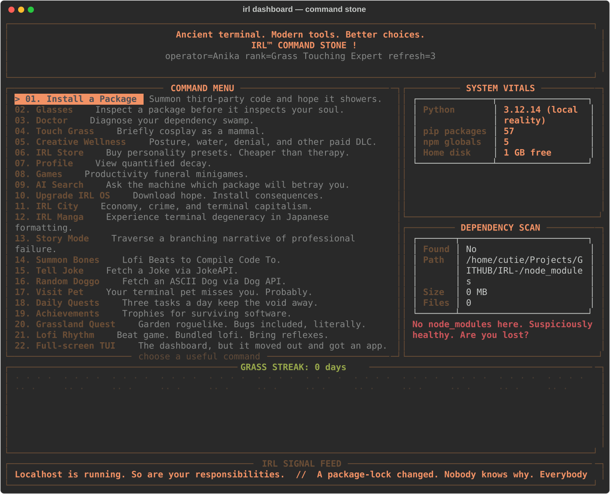
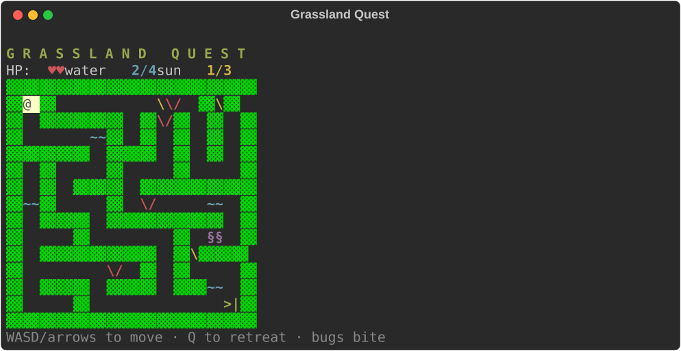
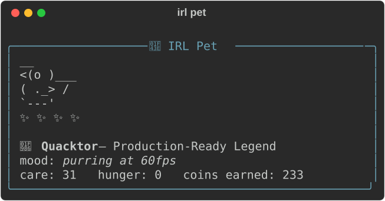
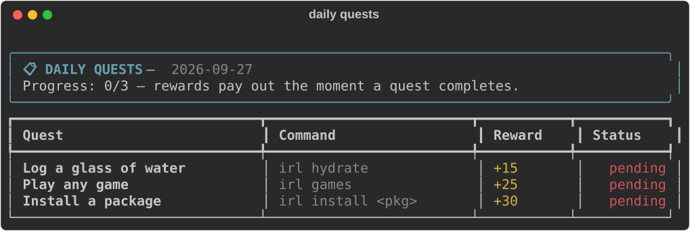
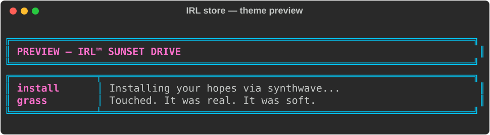
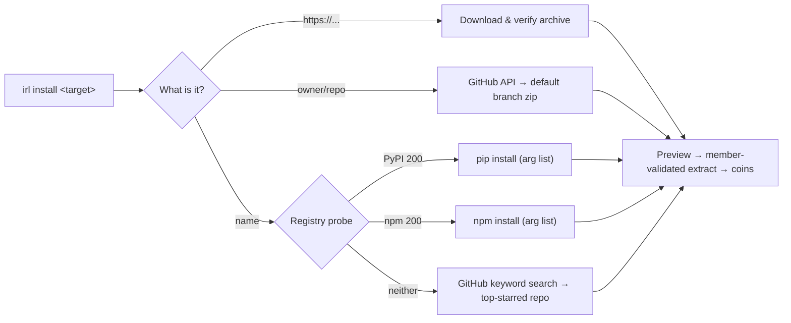

<div align="center">

```text
██╗██████╗ ██╗
██║██╔══██╗██║
██║██████╔╝██║
██║██╔══██╗██║
██║██║  ██║███████╗
╚═╝╚═╝  ╚═╝╚══════╝
```

### ✨ Software for Humans. Useful tools. Less terminal drama. ✨

*The terminal command center that installs anything, remembers you're a mammal,
and pays you coins for touching grass.*

[](https://pypi.org/project/irl-pkg/)
[](https://pepy.tech/projects/irl-pkg)
[](https://pypi.org/project/irl-pkg/)
[](https://pypi.org/project/irl-pkg/#files)
[](LICENSE)
[](https://github.com/Dev2Creator/IRL-/stargazers)
[](https://github.com/Dev2Creator/IRL-/actions)

**Linux · macOS · Windows** — one codebase, zero platform drama.

[Install](#-install) · [The Tour](#-the-tour-in-six-screenshots) · [Commands](#-commands) · [How It Works](#-how-it-works) · [Easter Eggs](#-the-secret-part)

</div>

---

## 📦 Install

```bash
pip install --upgrade irl-pkg
```

```bash
irl
```

First launch gives you a 30-second onboarding: a splash, a name, a vibe picker
with live previews, and a tour. After that, it's just your terminal — but nicer.

```bash
pip install 'irl-pkg[tui]'   # optional: the full-screen Textual app
```

---

## 🎬 The Tour, in Six Screenshots

Every screenshot below is **real irl output**, rendered from the live program.

<div align="center">

### The Dashboard

Real system stats, a GitHub-style grass contribution heatmap, rotating tips, and
every feature exactly one keypress away.



</div>

### The Universal Installer

```bash
irl install requests                       # PyPI
irl install express                        # npm
irl install owner/repo                     # GitHub
irl install https://example.com/pkg.zip    # direct URL
```

One command. IRL sniffs the target, checks your system, downloads with a
progress bar, previews the archive, and extracts into a named directory —
**zip-slip-proof**. You earn coins. You always earn coins.

<div align="center">

### Grassland Quest 🌾

The garden-maze roguelike that ships free with every install. Collect water and
sunshine, dodge literal bugs, and face **The Deadline** in boss combat. Winning
extends your grass streak.



### Your Pet 🦆

Adopt a rubber duck, cat, dog, or fern. It evolves with your care and your
grass streak — from Egg of Potential to Production-Ready Legend. Skip days and
it sulks. Visibly. Pets keep receipts.



### Daily Quests 📋

Three date-seeded tasks a day. Rewards pay out the moment a quest completes —
and `irl` itself reports them, whether you installed, hydrated, or visited city.



### The Theme Store 🏪

Eighteen themes with live previews before you buy. Synthwave. Sakura. Terminal
Classic. High-Contrast. And one you have to find.



</div>

---

## 🗺️ Commands

<details open>
<summary><b>🧰 The useful part — package superpowers</b></summary>

| Command | What it does |
|---|---|
| `irl install <pkg>` | Installs from **PyPI, npm, GitHub (`owner/repo`), or a direct URL** — it figures out the registry. |
| `irl glasses <pkg>` | Inspects before you trust it: version, size, source. |
| `irl doctor <pkg>` | Checks network, storage, and toolchain *before* installs go sideways. |
| `irl search <query>` | AI-assisted package search that ends in an install offer. |
| `irl run <cmd>` | Runs a command; in a project folder it quietly becomes `npm run <cmd>`. |
| `irl rollback [ver]` | Time-travels irl-pkg to any published version. Interactive picker, `--yes` for the impatient. |
| `irl upgrade` | Upgrades IRL™ itself via a delayed, detached pip process. |
| `irl lang` | The bundled `.irl` toy language: `run <file>`, `demo`, or a persistent-env `repl`. |

</details>

<details>
<summary><b>🌱 The wellness part — mammals need maintenance</b></summary>

| Command | What it does |
|---|---|
| `irl grass` | Touch grass. Daily. Streaks, ranks, and a heatmap you'll feel guilty breaking. |
| `irl hydrate` / `posture` / `window` / `mirror` | Small rituals with strong opinions about your spine. |
| `irl quests` | Three daily quests that pay coins. |
| `irl achievements` | 12 trophies + XP levels: **Noob → Code Gremlin → 10x Dev → Grass Sensei**. |
| `irl pet` | A terminal tamagotchi. It earns coins. It remembers neglect. |
| `irl chaos` | A quiz. About bugs. And hubris. |

</details>

<details>
<summary><b>🎮 The fun part — productivity's natural predators</b></summary>

| Command | What it does |
|---|---|
| `irl dashboard` | Mission control: real stats, heatmap, tips, 22 commands, arrow-key driven. |
| `irl games` | The game library — press **G** for Grassland Quest, **R** for Lofi Rhythm. Both free. |
| `irl grassland` | Garden-maze roguelike: seeded mazes, roaming bugs, boss fight, streak bonus. |
| `irl rhythm` | 4-lane falling-note beat game (D/F/J/K) charted from 71 bundled lofi loops. Same song → same chart. |
| `irl city` | IRL City: jobs, car theft, bank robberies, a wanted level, and consequences. |
| `irl store` | 18 themes, spare parts, games. Live previews included. |
| `irl story` | Branching themed stories. One of them is about MS-DOS. |
| `irl bones` / `joke` / `dog` / `manga` | Lofi beats, developer jokes, ASCII dogs, manga reader. |
| `irl tui` | Full-screen Textual app: home, installer, games, lofi player. `pip install 'irl-pkg[tui]'`. |

</details>

<details>
<summary><b>🔑 The secret part — codes open doors</b></summary>

Some things aren't in the help. The dashboard listens for more than arrow keys.
Numbers can be answers. Food can arrive in 30 minutes or fewer.

One of the store's eighteen themes cannot be bought. It has to find you.

</details>

---

## ⚙️ How It Works

### Install routing



### The engine room

| | |
|---|---|
| **`irl/keys.py`** | One keyboard abstraction. msvcrt on Windows, termios+tty on POSIX, normalized `Key` objects (`UP`/`ENTER`/`CTRL_C`/`CHAR('q')`...), non-TTY safe — games and the dashboard both sit on it. |
| **`irl/audio.py`** | Auto-detecting playback chain: **winsound → aplay → ffplay → afplay → paplay**. Fire-and-forget, arg lists, a looping thread for the rhythm game. No backend? Air guitar. |
| **`irl/ui.py`** | The design system: gradient wordmark, brand panels, spinners, Nerd Font icons **with automatic ASCII fallback**, and errors that help. |
| **`irl/extract.py`** | Downloads to a sanitized filename, previews the archive, extracts into a **named directory** — every member resolved and validated against the target (zip-slip), symlinks rejected. |
| **`irl/rollback.py`** | Live version list from the PyPI JSON API, questionary picker, detached `pip` child with `CREATE_NEW_PROCESS_GROUP` via `getattr` — POSIX-safe. |
| **`irl/lang/`** | The `.irl` toy language: `snag` `spill` `bet` `cap` `grind` `brb` `task`, `fax`/`fake`. Lexer → parser → interpreter, shipped in the wheel. |

### Determinism, deliberately

Mazes and beatmaps are seeded: Grassland Quest mazes come from a
recursive-backtracker with a fixed seed, and Lofi Rhythm charts are derived from
`sha256(filename)` + the WAV's real duration (stdlib `wave`). Same song, same
chart — so high scores mean something, and the tests are just tests.

### Where your stuff lives

| File | Contents |
|---|---|
| `~/.irl_state.json` | Name, coins, XP, owned themes |
| `~/.irl_grass.json` | Streak + heatmap history |
| `~/.irl_pet.json` | Your pet's entire worldview |
| `~/.irl_quests.json` | Today's board |
| `~/.irl_rhythm.json` | Per-track high scores |
| `~/.irl_achievements.json` | Trophy case |

Delete them to start over. Your pet will remember, briefly.

---

## 🛡️ Security Posture

- **No `shell=True` anywhere.** Every subprocess is an argument list.
- **Zip-slip-proof extraction**: each archive member is resolved and verified
  against the target directory before a single byte is written; absolute paths,
  `..` traversal, Windows drive letters, and symlink members are rejected.
- **Preview before extract** — you see what lands on disk, and approve it.
- **Sanitized download filenames** — Content-Disposition can't write outside.
- **SSL verification stays on** for every registry and API call.

---

## 🧪 Project Health

```bash
ruff check .        # zero violations
pytest              # 114 tests, logic coverage: routing, zip-slip, mazes,
                    # charts, streaks, pets, quests, achievements, language
python -m build     # 976 KB wheel (down from 13.4 MB)
```

CI: **Ubuntu · macOS · Windows × Python 3.9 → 3.13**, plus build checks and a
coverage gate. Releases: tag `v*` → test → build → **PyPI trusted publishing**
→ GitHub Release generated from [CHANGELOG.md](CHANGELOG.md). Dependabot and
issue/PR templates included — see [CONTRIBUTING.md](CONTRIBUTING.md).

<details>
<summary><b>Wheel size: the story of the 12.4 MB DOS game</b></summary>

<br>

The 1.x wheel shipped with the original **GTA 1997** DOS executable zipped
inside — 12.4 MB of pure nostalgia we couldn't legally redistribute. In 2.0 it
has officially *ridden into the sunset*. Pressing `G` in IRL City now offers a
moment of silence, and the wheel weighs **976 KB**.

The lofi loops stayed. They're only 1.4 MB and they're the soundtrack now.

</details>

<details>
<summary><b>FAQ</b></summary>

**Is the gamification mandatory?**
No. Every game and streak is strictly opt-in. `irl install` works exactly the
same whether you have a pet or not.

**Does it phone home?**
No telemetry. The only network calls are to the registries and APIs you ask it
to talk to (PyPI, npm, GitHub, dog.ceo...).

**Why AGPL?**
Because tools that people depend on should stay open. Fork away; the headers
ask you to share improvements too.

**Python 3.8 in 2026?**
Yes — old machines deserve nice terminals too. Everything also runs on 3.13.

**Windows, really?**
Really. Same commands, same colors, same pet. msvcrt/winsound under the hood
where needed.

</details>

---

## 🗺️ Roadmap

- [ ] `irl graph` — dependency tree visualizer
- [ ] Grassland Quest: seasonal events + mutators
- [ ] Plugin API for custom quests
- [ ] Pet co-op (multi-pet households)

## 👤 Author

<div align="center">

**Anika Mukherjee** — [Dev2Creator](https://github.com/Dev2Creator)

*IRL™ is a trademark of Anika Mukherjee.*

</div>

## 📜 License

Copyright © 2026 Anika Mukherjee. Released under the **GNU Affero General
Public License v3 or later** — see [LICENSE](LICENSE).

<div align="center">

**Software for Humans.** Useful tools. Less terminal drama. 🌱

`pip install irl-pkg` — your grass misses you.

</div>
